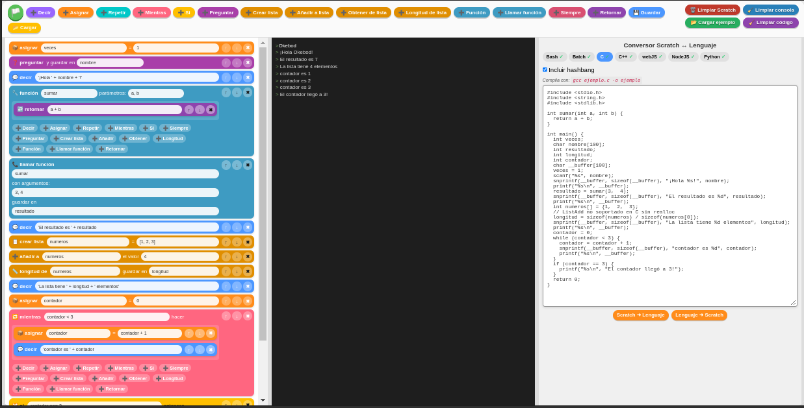

# Convertidor de Bloques a Código (Scratch2Code)

Herramienta educativa e interactiva que permite programar mediante un editor de bloques visuales (estilo Scratch) y generar automáticamente código fuente en diversos lenguajes de programación como Bash, Python, C, C++, NodeJS y WebJS. También ofrece la funcionalidad inversa (traducir lenguaje a bloques).

## ✨ Características

- **Traducción Inversa:** Soporte para convertir código a bloques (Lenguaje -> Scratch).
- **Interfaz en Español:** Diseñada específicamente para hispanohablantes.
